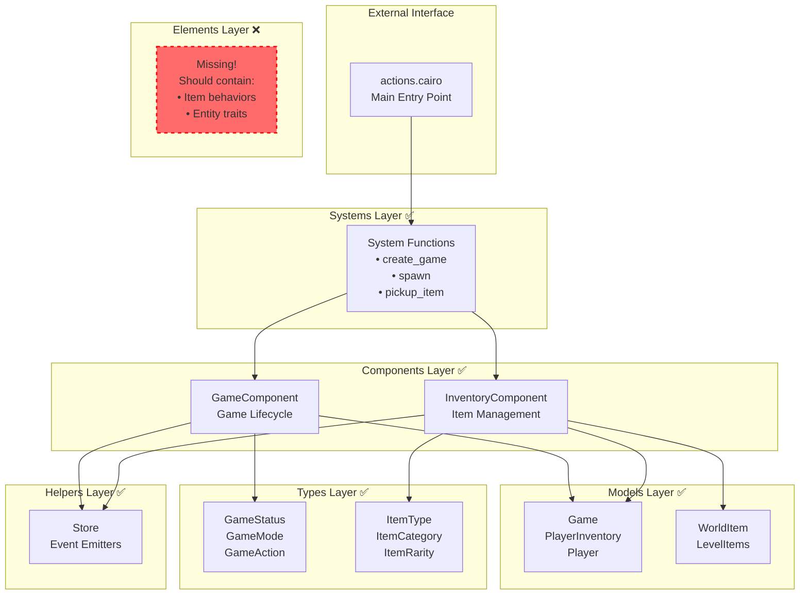
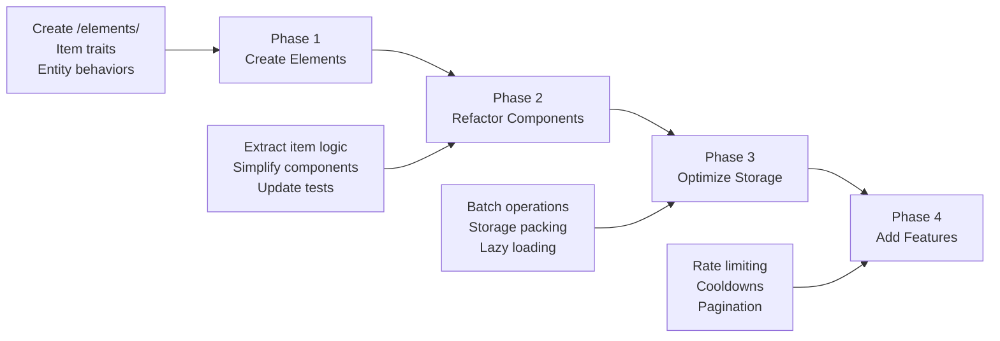

# Elysium Descent Contract Architecture

## Current Architecture Overview

## Shinigami Pattern Implementation Status

| Layer | Status | Directory | Purpose |
|-------|--------|-----------|---------|
| Systems | ✅ Implemented | `/systems/` | External interface and entry points |
| Components | ✅ Implemented | `/components/` | Business logic orchestration |
| Models | ✅ Implemented | `/models/` | Persistent on-chain state |
| Types | ✅ Implemented | `/types/` | Enums and type definitions |
| Helpers | ✅ Implemented | `/helpers/` | Utility functions |
| Elements | ❌ Missing | `/elements/` | Game entity behaviors |

## Architecture Evolution Path

## Key Architectural Patterns

### 1. Store Pattern (Unified Data Access)
- Centralized model access through Store helper
- Consistent read/write operations
- Simplified testing with single entry point

### 2. Event-Driven State Changes
- All state mutations emit events
- Enables off-chain indexing via Torii
- Supports client synchronization

### 3. Composite Key Models
- Efficient lookups with multi-field keys
- Example: WorldItem uses (game_id, item_id)
- Supports complex relationships

### 4. Type-Safe Action Routing
- GameAction enum with embedded data
- Compile-time validation
- Clear action semantics

## Recommended Improvements

1. **Implement Elements Layer**
   - Extract item-specific behaviors from components
   - Create trait-based interfaces for game entities
   - Enable better code reuse and testing

2. **Enhance Gas Optimization**
   - Implement batch update operations
   - Consider storage packing for related fields
   - Add lazy loading patterns

3. **Add Missing Features**
   - Cooldown enforcement
   - Rate limiting mechanisms
   - Pagination for large datasets

## Architecture Metrics

| Metric | Current | Target | Priority |
|--------|---------|--------|----------|
| Layer Implementation | 5/6 | 6/6 | High |
| Test Coverage | 98 tests | 100+ | Low |
| Gas Optimization | Basic | Advanced | Medium |
| Security Patterns | Good | Excellent | Low |
| Modularity | High | Very High | Medium |